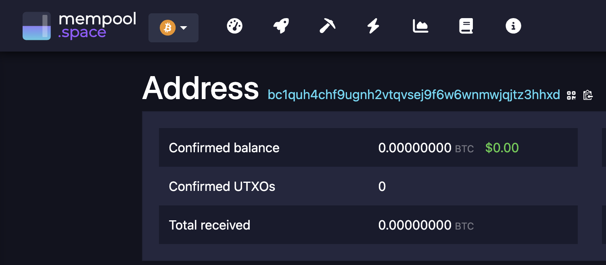

# Bitcoin Wallet Generator


A Python implementation of Bitcoin wallet generation following BIP39, BIP32, and BIP84 standards. This tool demonstrates how Bitcoin wallets derive addresses from mnemonic phrases.

## Features

- Generate 12-word BIP39 mnemonic phrases
- Convert mnemonic to BIP32 master key
- Derive private keys using hierarchical deterministic (HD) path
- Create native SegWit (bech32) addresses
- Output keys in standard formats (WIF, compressed public key)

## Installation

```bash
poetry install
```

## Usage

```bash
poetry run python btc.py
```

## Example Output

```
martincastrolaminrs@Martins-MacBook-Air bitcoin-wallet-generator % poetry run python btc.py
Mnemonic: ****** ****** ****** ****** ****** ****** ****** ****** ****** ****** ****** ******
Seed: ****************************************************************
Master private key: ****************************************************************
Master chain code: ****************************************************************
Derived private key (m/84'/0'/0'/0/0): ****************************************************
WIF private key: ****************************************************
Public key: 03acd484e2f0c7f65309ad178a9f559abde09796974c57e714c35f110dfc27ccbe
Bitcoin address (bech32): bc1qw508d6qejxtdg4y5r3zarvary0c5xw7kv8f3t4
```

## Key Components Explained

### 🔑 1. Mnemonic (12-word seed phrase)
```
****** ****** ****** ****** ****** ****** ****** ****** ****** ****** ****** ******
```

This is the human-readable backup of your wallet.

- Encodes 128 bits of entropy
- Can regenerate your entire wallet
- Any standard Bitcoin wallet (Ledger, Trezor, Electrum, BlueWallet, Sparrow) can restore from it
- If you lose everything except these 12 words, you can always recover your BTC

⚠️ **Anyone who gets these 12 words controls your Bitcoin.**

### 🌱 2. Seed (64 bytes, hex)
```
****************************************************************...
```

This is the raw binary BIP39 seed generated from your mnemonic.

- The seed is used to derive the BIP32 master key
- Most wallets never show this to the user
- It's not meant for humans
- Think of the seed as the machine version of your mnemonic

### 🗝️ 3. Master private key (extended root key)
```
****************************************************************
```

This is the root from which your entire hierarchical wallet is derived.

- Known as `m` in BIP32
- Stored internally by wallets
- Never shared
- If compromised, all derived child keys are compromised
- It's like the "master password" of all addresses

### 🔗 4. Master chain code
```
****************************************************************
```

The chain code provides extra entropy for deriving child keys.

Think of it as:
- A second secret paired with the master key
- Ensures each child key is strongly unique
- Part of the BIP32 HD tree security model
- Also hidden by wallets

### 🧬 5. Derived private key (m/84'/0'/0'/0/0)
```
****************************************************
```

This is the actual private key for your first receiving address.

The path `m/84'/0'/0'/0/0` means:
- `84'` = BIP84 (Native SegWit, bc1 addresses)
- `0'` = Bitcoin mainnet
- `0'` = account 0
- `0` = external chain (receiving addresses)
- `0` = index 0 (first address)

This matches exactly how Ledger, Trezor, Electrum, Sparrow derive addresses.

### 🔐 6. WIF private key
```
****************************************************
```

WIF = Wallet Import Format

This is the version of the private key used by Bitcoin wallets.

You can paste this into:
- Electrum
- Sparrow
- Bitcoin Core
- BlueWallet
- Etc.

And it will restore only this single address (not the entire HD wallet).

⚠️ **Sharing the WIF is equivalent to sharing the private key.**

### 👁️ 7. Public key (compressed)
```
03acd484e2f0c7f65309ad178a9f559abde09796974c57e714c35f110dfc27ccbe
```

The public key is derived from the private key:

- Used to generate Bitcoin addresses
- Safe to share
- Required for verifying signatures
- Compressed format starts with 02 or 03
- This is the mathematical point on the SECP256k1 curve

### 🏦 8. Bitcoin address (bech32)
```
bc1qw508d6qejxtdg4y5r3zarvary0c5xw7kv8f3t4
```

This is your real BTC address, the one people send funds to.

- Starts with `bc1` → Native SegWit (BIP84)
- Best fee efficiency
- Cheapest to spend
- Modern standard

This address is fully controlled by:
- Your derived private key
- Your mnemonic
- Your seed
- Your HD master key

Send BTC here and you can recover it from any Bitcoin wallet using the 12-word mnemonic.

## Checking Address Balance



You can check the balance and transaction history of any generated Bitcoin address using a blockchain explorer:

```
https://mempool.space/address/bc1qw508d6qejxtdg4y5r3zarvary0c5xw7kv8f3t4
```

Replace the address at the end with your generated bech32 address. Mempool.space provides:

- Current BTC balance
- Transaction history
- UTXO (Unspent Transaction Output) details
- Fee recommendations
- Network statistics

Other popular Bitcoin explorers include:
- [Blockstream.info](https://blockstream.info)
- [Blockchain.com](https://blockchain.com)
- [Btc.com](https://btc.com)

## Cross-Chain Swaps with THORSwap

[THORSwap](https://thorswap.finance) enables seamless cross-chain swaps without centralized exchanges. You can swap USDC from Ethereum directly to BTC on Bitcoin:

### USDC (Ethereum) → BTC (Bitcoin) Process:

1. **Connect your Ethereum wallet** containing USDC to THORSwap
2. **Select swap pair**: 
   - From: USDC (Ethereum network)
   - To: BTC (Bitcoin network)
3. **Enter your Bitcoin address** (the bech32 address generated by this tool)
4. **Set slippage tolerance** (typically 1-3% for large swaps)
5. **Execute the swap**:
   - THORSwap burns your USDC on Ethereum
   - THORChain's liquidity pools facilitate the exchange
   - Native BTC is sent directly to your Bitcoin address

### Key Benefits:
- **Truly decentralized**: No KYC, no account creation
- **Cross-chain native**: Receive actual BTC, not wrapped tokens
- **Non-custodial**: You control your keys throughout
- **Direct settlement**: BTC arrives in your self-custody address

### Important Notes:
- Minimum swap amounts apply (usually ~$10-50)
- Network fees apply on both chains
- Larger swaps may experience slippage
- Transaction times vary (5-30 minutes typically)

This workflow allows you to move value from Ethereum DeFi directly to Bitcoin self-custody using the addresses generated by this tool.

## Security Warning

⚠️ **This is for educational purposes only.** Never use generated keys/addresses for real Bitcoin storage unless you understand the security implications.

- Keep your mnemonic phrase secure and private
- Never share your private keys
- Use hardware wallets for significant amounts
- Test with small amounts first

## Dependencies

- `mnemonic` - BIP39 mnemonic generation
- `ecdsa` - Elliptic curve cryptography
- `base58` - Bitcoin address encoding
- `bech32` - SegWit address encoding

## Standards Implemented

- **BIP39**: Mnemonic code for generating deterministic keys
- **BIP32**: Hierarchical Deterministic (HD) Wallets
- **BIP84**: Derivation scheme for P2WPKH based accounts